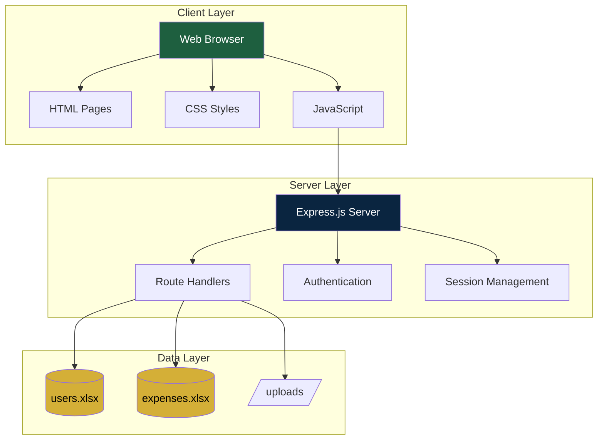
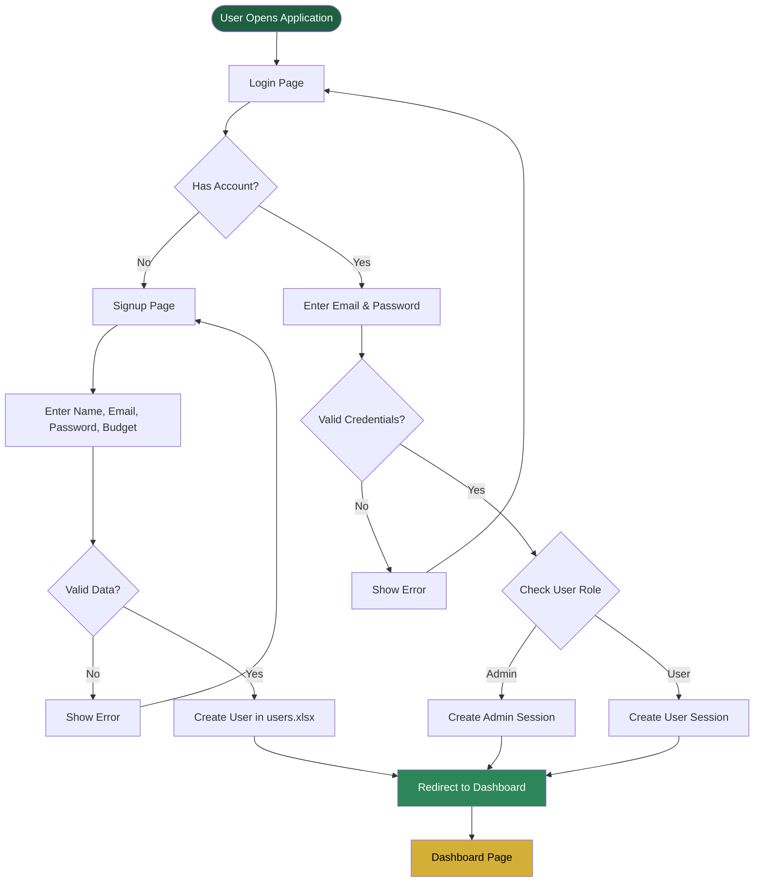
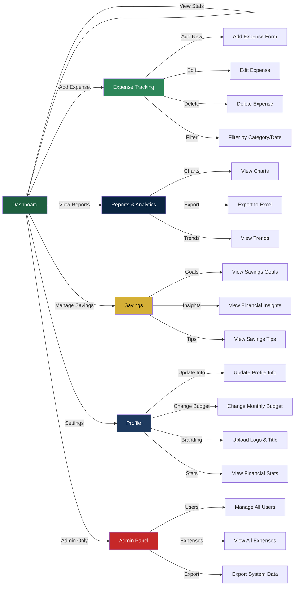
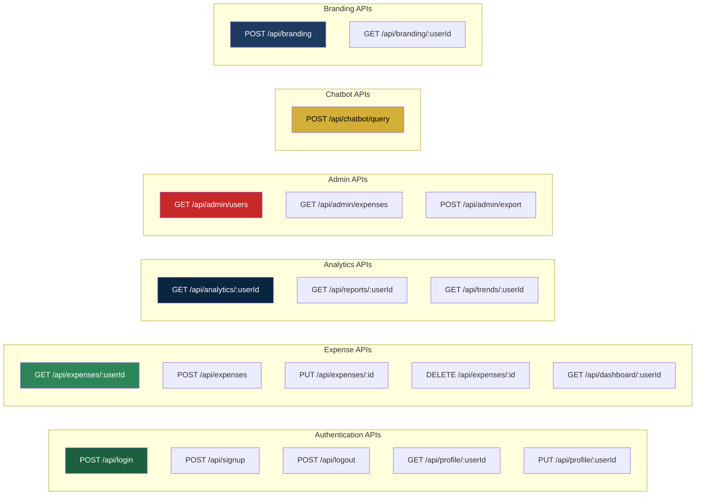
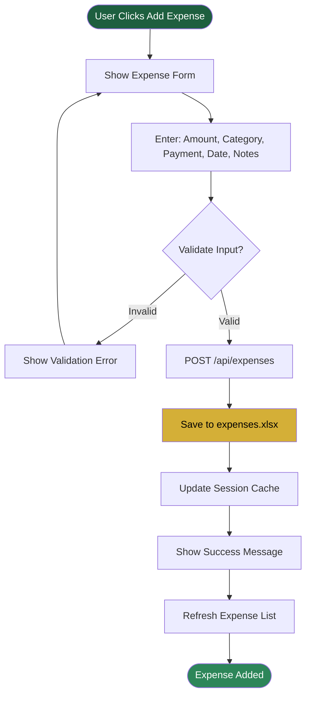
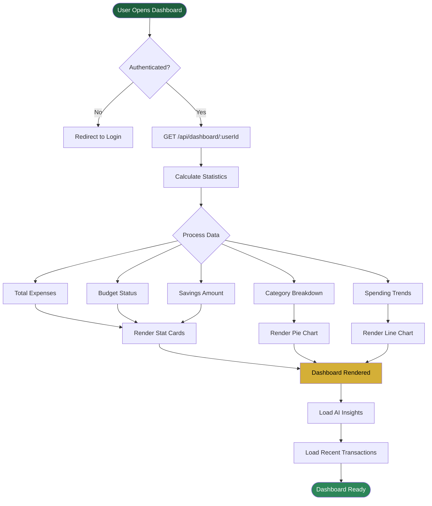
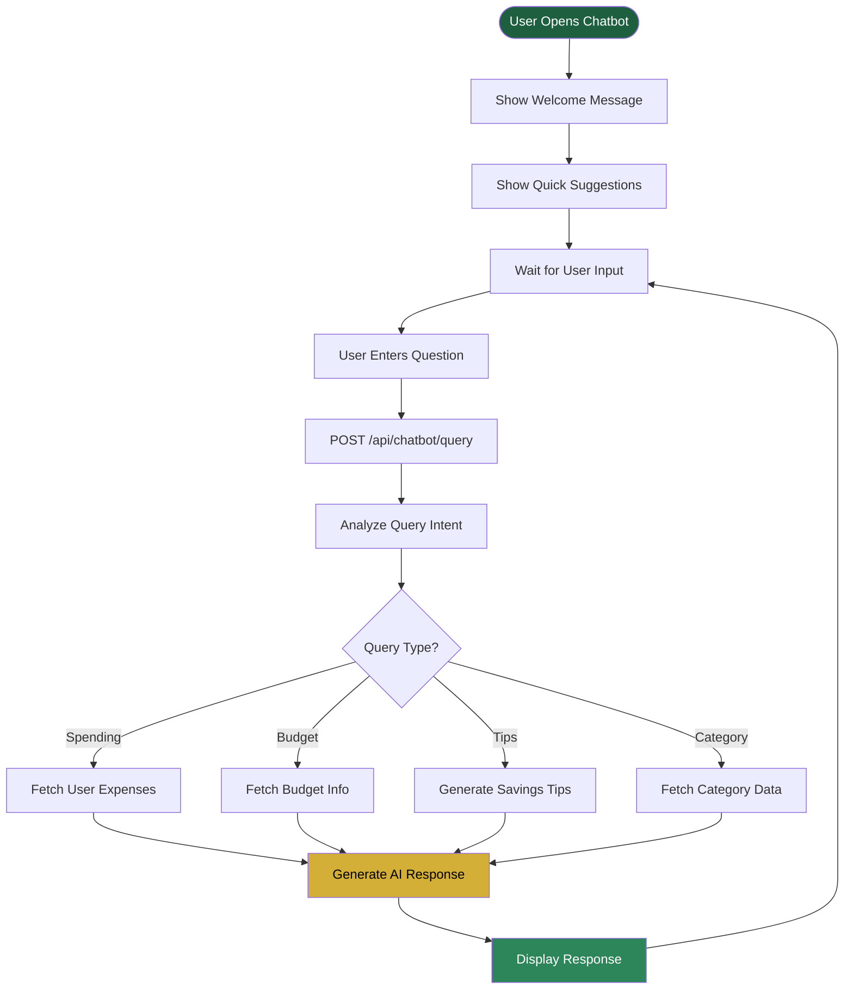
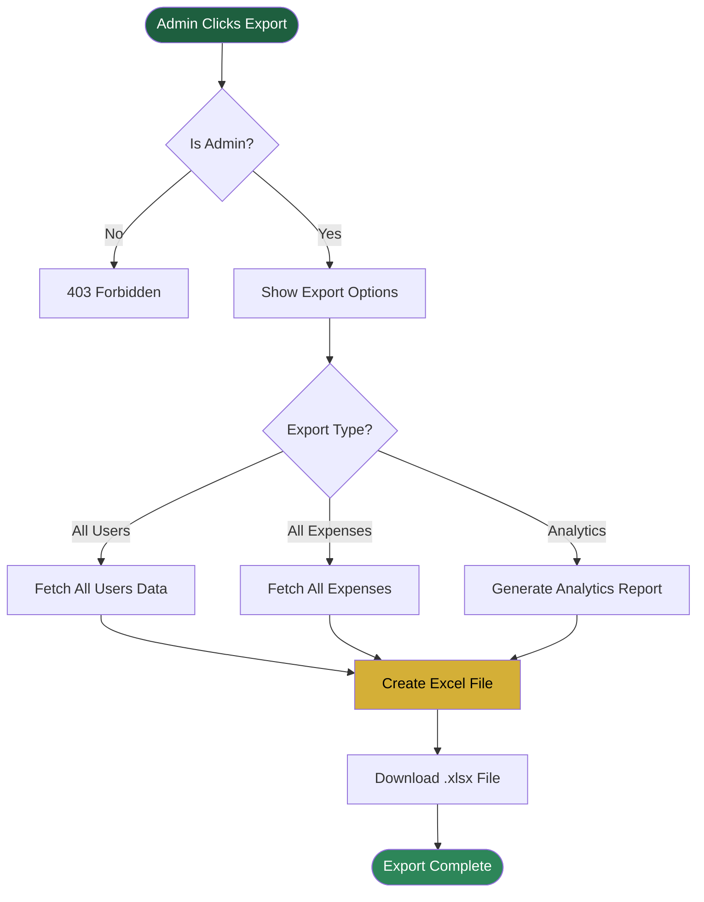
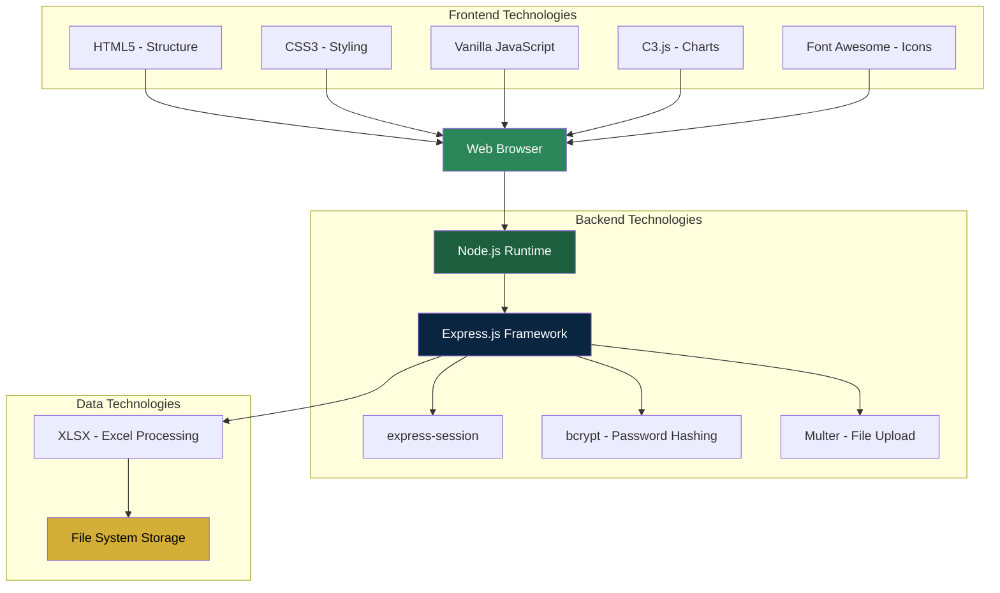

# TrackMyExpenses - Project Flowchart Documentation

## Table of Contents
1. System Architecture
2. User Authentication Flow
3. Application Navigation Flow
4. Data Flow Architecture
5. API Endpoints Map
6. Feature Workflows

---

## 1. System Architecture



---

## 2. User Authentication Flow



---

## 3. Application Navigation Flow



---

## 4. Data Flow Architecture

```mermaid
flowchart TB
    subgraph "Frontend"
        Page[HTML Page]
        FormData[User Input / Form Data]
        Display[Display Results]
    end
    
    subgraph "API Layer"
        API[/api/ endpoints]
        AuthCheck{Authenticated?}
        RoleCheck{Authorized?}
    end
    
    subgraph "Business Logic"
        Auth[auth.js]
        Expenses[expenses.js]
        Analytics[analytics.js]
        Chatbot[chatbot.js]
        Excel[excel.js]
    end
    
    subgraph "Data Storage"
        UsersDB[(users.xlsx)]
        ExpensesDB[(expenses.xlsx)]
        UploadsDir[/uploads/]
    end
    
    Page --> FormData
    FormData --> API
    API --> AuthCheck
    AuthCheck -->|No| ErrorResponse[401 Unauthorized]
    AuthCheck -->|Yes| RoleCheck
    RoleCheck -->|No| ForbiddenResponse[403 Forbidden]
    RoleCheck -->|Yes| Router{Route to Handler}
    
    Router -->|/login, /signup| Auth
    Router -->|/expenses, /dashboard| Expenses
    Router -->|/analytics, /reports| Analytics
    Router -->|/chatbot| Chatbot
    
    Auth --> Excel
    Expenses --> Excel
    Analytics --> Excel
    
    Excel --> UsersDB
    Excel --> ExpensesDB
    Excel --> UploadsDir
    
    Excel --> Response[JSON Response]
    ErrorResponse --> Display
    ForbiddenResponse --> Display
    Response --> Display
    
    style FormData fill:#1e5f3f,color:#fff
    style Response fill:#2d8659,color:#fff
    style UsersDB fill:#d4af37,color:#000
    style ExpensesDB fill:#d4af37,color:#000
```

---

## 5. API Endpoints Map



---

## 6. Feature Workflows

### 6.1 Add Expense Workflow



### 6.2 Dashboard Loading Workflow



### 6.3 Chatbot Interaction Workflow



### 6.4 Admin Export Workflow



---

## 7. Database Schema (Excel Files)

### users.xlsx Structure
```
| id | email | password (hashed) | fullName | role | budget | createdAt | customTitle | customLogo |
```

### expenses.xlsx Structure
```
| id | userId | amount | category | paymentMode | date | notes | tags | createdAt |
```

---

## 8. Technology Stack Flow



---

## How to Convert to PDF

### Method 1: Using Browser
1. Open this file in a browser (VS Code Preview, GitHub, etc.)
2. Press `Ctrl+P` (Windows) or `Cmd+P` (Mac)
3. Select "Save as PDF"
4. Click Save

### Method 2: Using Markdown to PDF Tools
```bash
# Install markdown-pdf
npm install -g markdown-pdf

# Convert to PDF
markdown-pdf flowchart.md -o TrackMyExpenses_Flowchart.pdf
```

### Method 3: Using Pandoc
```bash
# Install pandoc
# Then run:
pandoc flowchart.md -o TrackMyExpenses_Flowchart.pdf
```

### Method 4: Using Online Tools
- Visit: https://www.markdowntopdf.com/
- Upload this file
- Download PDF

---

**Document Version**: 1.0  
**Last Updated**: February 2026  
**Project**: TrackMyExpenses - Modern Expense Tracker
